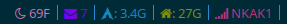

#GmailMonitor
A Script that can be used with `i3blocks` to show the new emails on your
bar. 
Modified from the script found <a
href="https://gist.github.com/smlb/7dca4b684ca52a2491d1"> here. </a>  
The xml was not getting parsed correctly. I fixed it by changing the `grep` line.
 
Add this to your `i3blocks.conf`
<code>
[mail]
command=echo -e " $(sh ~/GmailMonitor/mail.sh)"
interval=100
color=#7F00FF

</code>
Here is a preview.
 
